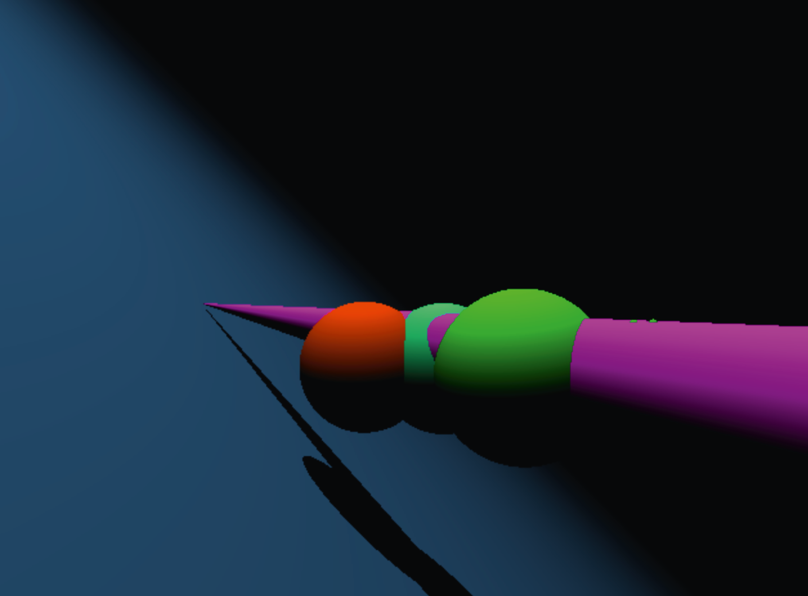

<h1 align="center">
  <br>
    RTv1
  <br>
</h1>

<h3 align="center">Simple raytracer engine, built in c with SDL2</h3>

</img>

<p align="center">
  <a href="#what-does-it-do">What does it do?</a> •
  <a href="#primitives">Primitives</a> •
  <a href="#how-to-use">How To Use</a> •
  <a href="#disclaimer">Disclaimer</a>
</p>

## What does it do?

* Renders pictures on the screen of a 3D scene.
* Renders simple primitives like cone, cylinder, sphere and plane.
* Takes in a parameter on the command line of a scene.
* Parses the data in the file and creates the scene accordingly.
* You can rotate the camera and objects from the files.

## Primitives
(sphere, cylinder, plane, cone)

</img>

## How To Use

To clone and run this application, you'll need [Git](https://git-scm.com) and a gcc compiler installed on your computer. Also you need miniLibX graphics library which to my knowledge doesn't work on windows. This has been tested only on MacOs. Run the following commands on the command line:

```bash
# Clone this repository
$ git clone https://github.com/PietarTheWise/RTv1.git
# Build the program by typing:
$ make
# in command line

#then run:
$ ./Rtv1 scenes/cool_scene

#Note: There are other scenes on the scenes folder that you can run with the program.
#You can also choose the colors, by changing the rbg values.

```
## With multiple colors:
<div align="center">
  </img>
</div>

## DISCLAIMER

<p>
This is a project from the 42 school, which is a school that utilizes peer to peer learning.
We're only given a document that gives us the details of the assignment, therefore each implementation
is unique. Each assignment is tested for crashes and other bugs thoroughly by other peers. Apart from some exceptions, existing
libraries are banned, these projects utilize our self made version of libc called libft.
</p>
